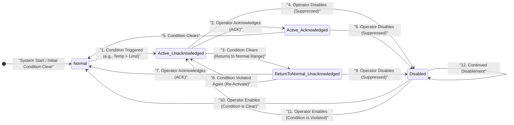

# acorn-alarms-service

A service that combines the alarms pathways for EPICS and ACNET, and provides a unified UI for viewing alarms.

## Composition

* Alarm Viewer - a browser-hosted UI application that displays alarms to users
* Alarm Server - a program that is the concentration point for all alarms
* Alarm Log - a utility that records a time-ordered list of alarm events

## Problem Analysis Notes

Likely to be moved to the Projects or Wiki tab at some point

### Concepts

Defining a common terminology for referring to analogous concepts between ACNET and EPICS

| Generic   | ACNET         | EPICS
|-----------|---------------|------
| Node      | Node          | IOC
| Device    | Device        | PV
| Property  | Property      | Attribute Structure
| Attribute | Attribute     | Field of Attribute Structure
| Value     | Reading Value | VAL Field

### ALARM

- An ALARM notifies users when Conditions are met
  - Conditions may be comparisons of Device data to limits
  - Conditions may be explicit boolean data from Devices
  - Conditions may be the states of other associated ALARMs
  - Conditions may be complex (require multiple triggers over time or constant trigger over time)
  
- An ALARM is a persistent collection of states:
  - BYPASSED (boolean)
    - True: Alarm cannot be Raised (see STATUS:Raised)
    - False: Alarm can be Raised
  - ACKNOWLEDGED (boolean)
    - True: Alarm has been seen by a User and shall no longer be Raised
    - False: Alarm has not yet been seen by a User and shall be Raised
  - STATUS (enumeration)
    -  Quiet: Conditions are not met
    -  Indicated: Conditions are met but Alarm is BYPASSED or ACKNOWLEDGED
    -  Raised: Conditions are met and Alarm is not BYPASSED nor ACKNOWLEDGED

#### Alarm States

| State Abbreviation | State Name | Description | Operator Action Required | Priority Level |
| :--- | :--- | :--- | :--- | :--- |
| **N** | Normal | The monitored parameter is within its defined operating limits. The alarm is inactive. | None | Lowest |
| **AU** | Alarm Active / Unacknowledged | The parameter has crossed an alarm limit (Hi/Lo) and the operator has **not** yet acknowledged it. This is the **highest priority state**. | **Acknowledge (ACK)** | Highest |
| **AA** | Alarm Active / Acknowledged | The parameter is **still** outside its limits, but the operator has acknowledged the event. The alarm remains present on the display. | None (Troubleshoot) | Medium |
| **RU** | Return-to-Normal / Unacknowledged | The parameter has returned to its normal operating range, but the operator has **not** yet acknowledged the condition clear. This state ensures cleared alarms are not missed. | **Acknowledge (ACK)** | Low |
| **D** | Disabled / Suppressed | The alarm logic has been manually and explicitly bypassed (e.g., for maintenance, or because the device is intentionally off-line). | None (Engineering action required for exit) | Lowest (Hidden) |

#### State Transitions

Key Diagram Notes:

Priority Shift: The transition from AU (Active / Unacknowledged) to AA (Active / Acknowledged) is the key operator action. This lowers the alarm's visual priority but keeps it present because the fault condition still exists.

The Latch: The state RU (Return-to-Normal / Unacknowledged) acts as a safety latch. It ensures the operator must acknowledge the event even if the physical fault clears itself quickly, preventing missed transient events. The transition from RU to AU allows a rapid re-activation if the condition bounces immediately.

Disabling: Disabling an alarm (D state) requires an engineer action and transitions back to either N or AU when re-enabled, depending on the instantaneous condition of the monitored parameter.

### Alarms Log

The Alarms Log will be a timestamped list of Alarms Events

### Alarms Event

An Alarms Event shall describe the state change of an ALARM

| Event Attribute | Description
|-----------------|------------
| Timestamp       | Date and Time of event
| New State       | New state of alarm (Quiet, Indicated or Raised)
| Action          | Bypassed changed, Acknowledged changed, Conditions met
| Actor           | User (for bypass and acknowledge) or Device

### Interfaces

#### Alarm Server to Alarm Source (DPM)

- [ ] Set up test ACNET device with alarms, read alarm property from DPM
- [ ] Set up test ACNET device with alarms, read alarm state from DPM
- [ ] Set up test EPICS device with alarms, read alarm property from DPM
- [ ] Set up test EPICS device with alarms, read alarm state from DPM

#### Alarm Server to Alarm Log

#### Alarm Server to Alarm Viewer

- [ ] API to get alarms in specified state going back specified time duration
- [ ] API to get specific alarm by name
- [ ] API to subscribe to alarm events
- [ ] API to bypass alarm
- [ ] API to acknowledge alarm
