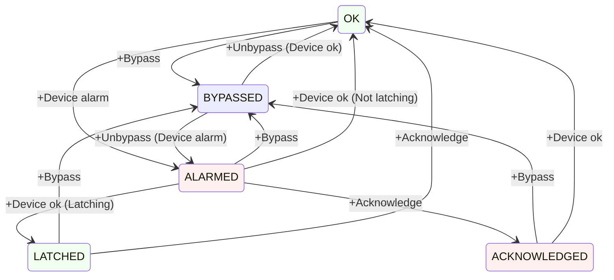

# acorn-alarms-service

A service that combines the alarms pathways for EPICS and ACNET, and provides a unified UI for viewing alarms.

## Operation

### Environment variables

The following environment variables may be set to configure the associated system properties.

- `CONTROLS_ALARMS_TOPIC` -> Configures the name of the topic in the Controls Kafka instance that alarms will be published to
- `CONTROLS_KAFKA_HOST` -> Configures the address of the Controls Kafka instance
- `DEV_DB_ADDR` -> Configures the address of the device database gRPC service
- `KAFKA_CONNECTION_SECONDS` -> Configures the amount of time, in seconds, to wait for a response from the Kafka server
- `PIP_II_ALARMS_TOPIC` -> Configures the name of the topic in the PIP-II Kafka instance that alarms will be published to
- `PIP_II_KAFKA_HOST` -> Configures the address of the PIP-II Kafka instance

## Design

### Startup

- Determine the set of all device alarms.
  - Request all Devices having analog and/or digital alarms from an ACNET Device gRPC service
  - Request all Devices (i.e. PV's) having value alarms from an EPICS Device gRPC service
- If necessary, read the initial alarm state of every device alarm (TBD - we may get this for free by setting the listeners below)
- Read the most recent information from Kafka for all device alarms
  - Bypass state (EPICS only)
  - Snooze stop time (ACNET and EPICS)
  - Acknowledge state (ACNET and EPICS)
- Begin listening to all device alarms via DPM/Data-Cache for changes to alarm state
  - Devices should be divided into manageable subsets and listened to via multiple DRF requests (rather than one huge one)

### Alarm Listening

- Report changes of alarm states by adding records to a Kafka service

| Kafka       | Device  | ACORN          | Description
|-------------|---------|----------------|------------
| `OK`        | `OK`    | `OK`           | There is not an alarm
| `ALARM`     | `ALARM` | `ALARMED`      | There is an alarm
| `---`       | `---`   | `BYPASSED`     | There may be an alarm but we are ignoring it
| `ALARM_ACK` | `ALARM` | `ACKNOWLEDGED` | There is an alarm but user has acknowledged it
| `ALARM`     | `OK`    | `LATCHED`      | There was an alarm but no user acknowledged it

- Periodically re-request the set of all device alarms
  - Cancel and re-issue alarm listening requests if device alarm set has changed

### Alarm States

