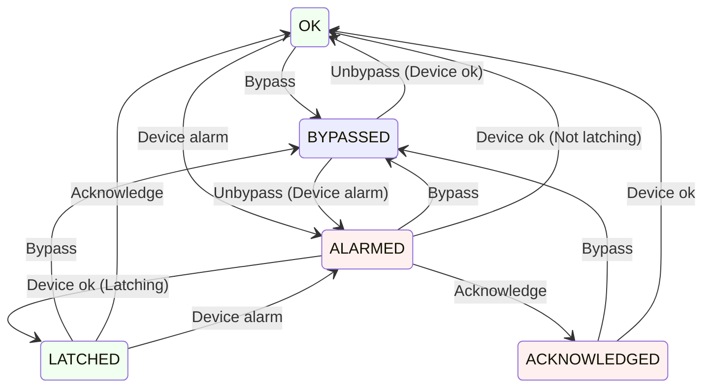

# acorn-alarms-service

A service that combines the alarms pathways for EPICS and ACNET, and provides a unified UI for viewing alarms.

## Operation

### Environment variables

The following environment variables may be set to configure the associated system properties.

- `CONTROLS_ALARMS_TOPIC` -> Configures the name of the topic in the Controls Kafka instance that alarms will be published to
- `CONTROLS_KAFKA_HOST` -> Configures the address of the Controls Kafka instance
- `DEV_DB_ADDR` -> Configures the address of the device database gRPC service
- `KAFKA_CONNECTION_SECONDS` -> Configures the amount of time, in seconds, to wait for a response from the Kafka server
- `PIP_II_ALARMS_TOPIC` -> Configures the name of the topic in the PIP-II Kafka instance that alarms will be published to
- `PIP_II_KAFKA_HOST` -> Configures the address of the PIP-II Kafka instance

## Development

The following packages must be present on the host machine when building this application:
- `cmake`
- `libcurl4-openssl-dev`
- `librdkafka-dev`
- `libsasl2-dev`
- `zlib`

## Design

### Startup

- Determine the set of all device alarms
  - Request all Devices having analog and/or digital alarms from an ACNET Device gRPC service
  - Request all Devices (i.e. PV's) having value alarms from an EPICS Device gRPC service
- If necessary, read the initial alarm state of every device alarm (TBD - we may get this for free by setting the listeners below)
- Read the most recent information from Kafka for all device alarms
  - Bypass state (EPICS only)
  - Snooze stop time (ACNET and EPICS)
  - Acknowledge state (ACNET and EPICS)
- Begin listening to all device alarms via DPM/Data-Cache for changes to alarm state
  - Devices should be divided into manageable subsets and listened to via multiple DRF requests (rather than one huge one)

### Alarm Listening

- Report changes of alarm states by adding records to a Kafka service
- Monitor Kafka for changes from clients (ACORN or Phoebus)
- Periodically re-request the set of all device alarms from Device gRPC service(s)
  - Cancel and re-issue alarm listening requests if device alarm set has changed

### Device/Kafka Alarm States

| State          | Description
|----------------|------------
| `OK`           | There is not an alarm
| `ALARMED`      | There is an alarm
| `BYPASSED`     | There may be an alarm but we are ignoring it
| `ACKNOWLEDGED` | There is an alarm but user has acknowledged it
| `LATCHED`      | There was an alarm but no user acknowledged it

- Device is source of truth for alarm (ACNET and EPICS)
- Device is source of truth for bypass (ACNET)
- Kafka is source of truth for bypass (EPICS)
- Kafka is source of truth for acknowledge (ACNET and EPICS)
- Complete alarm state information can always be read from Kafka

### Server State Transitions



### Kafka Schema

A single Kafka topic shall be maintained for recording alarm state information. Keys shall be unique (non-duplicating records) and shall record the most recent state of alarms for a given device.

The Key for a record shall be the device name, and the payload shall be a JSON string.

Given the respective rules of operation for ACNET and EPICS:
- An ACNET device record shall only have either a single "analog" element and/or a single "digital" element.
- An EPICS device record shall only have a single "epics" element.

#### JSON Schema for Values
```
{
  "analog"  : { <JSON> }  //  ACNET analog alarm (can also have digital)
  "digital" : { <JSON> }  //  ACNET digital alarm (can also have analog)
  "epics"   : { <JSON> }  //  EPICS alarm (type specified by "type" below)(aka EPICS 'status')
  "state"   : "ok" | "alarmed" | "bypassed" | "latched" | "acknowledged"
  "time"    : { "seconds":<int64>, "nanos":<int32> }  //  per gRPC Timestamp
  "type"    : "hihi" | "high" | "low" | "lolo" | ...  //  optional see EPICS alarm status definitions
  "user"    : <name of user who changed state>        //  optional
  "wake"    : { "seconds":<int64>, "nanos":<int32> }  //  optional
}
```
[EPICS alarm status definitions]( https://docs.epics-controls.org/projects/base/en/7.0.10/alarm_h.html)

#### Example Kafka Records

| Key | Value
|-----|------
| G:AMANDA | { "analog" : {<br>&emsp;&emsp;"state" : "acknowledged",<br>&emsp;&emsp;"time" : { "seconds" : 1234, "nanos" : 5678 },<br>&emsp;&emsp;"user":"dave"<br>&emsp;},<br>&nbsp;&nbsp;&nbsp;"digital" : {<br>&emsp;&emsp;"state" : "alarmed",<br>&emsp;&emsp;"time" : { "seconds" : 2345,"nanos" : 6789 }<br>}&nbsp;&nbsp;}
| PIP2IT:pHB650_CRYO_TX103:TempK | { "epics" : {<br>&emsp;&emsp;"state" : "alarmed",<br>&emsp;&emsp;"time" : { "seconds" : 1234, "nanos" : 5678 },<br>&emsp;&emsp;"type" : "hihi"<br>}&nbsp;&nbsp;}
| Z:ACLTST | { "digital" : {<br>&emsp;&emsp;"state":"bypassed",<br>&emsp;&emsp;"time" : { "seconds" : 1234, "nanos" : 5678 },<br>&emsp;&emsp;"user":"dave",<br>&emsp;&emsp;"wake" : { "seconds" : 2345,"nanos" : 6789 }<br>}&nbsp;&nbsp;}

### Alarm Configuration Info (Device DB)

There is information describing an alarm that is useful to users, but does not change frequently and is not part of a state transition message, but can be read from the respective Device DB's.  These data include:
  - Alarm Description
  - Guidance Message
  - Severity (ACNET)
  - Latchable (Acknowledgeable)

This information can change, but likely only infrequently.  A feasible update strategy for this information might be to query the Device DB for config data about an alarm whever a state change for that alarm is processed, with some throttle to prevent updates being too frequent (perhaps minimum 10 seconds between updates per device).

### Public Interface (GraphQL)

#### User Actions

- Acknowledge Alarm
- Bypass/Unbypass Alarm
- Manage Alarm List(s)
