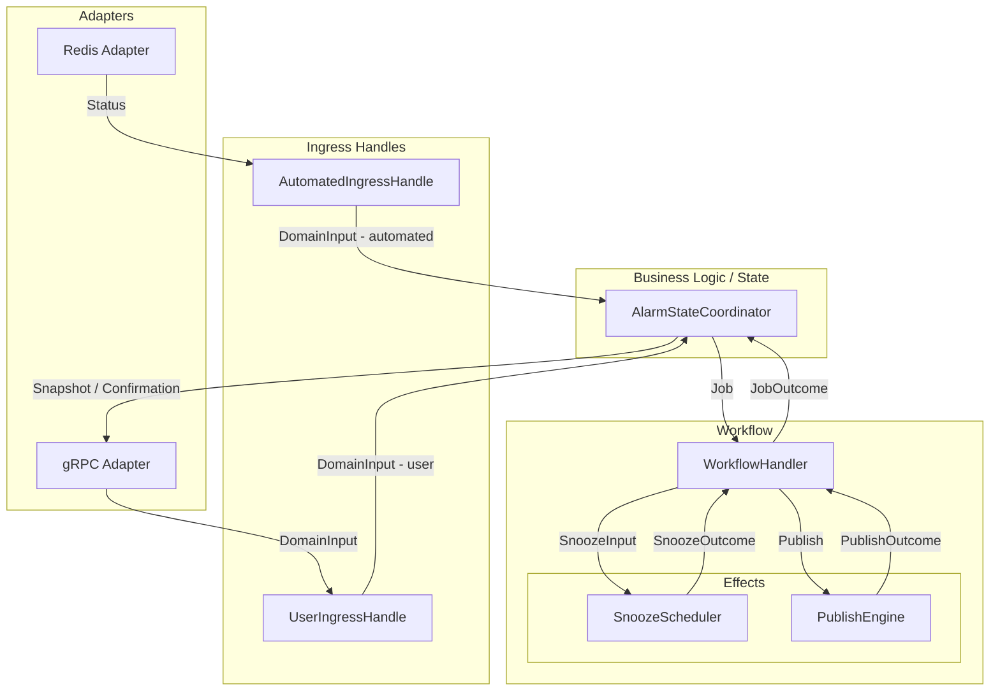

# grpc-alarms

`grpc-alarms` is an alarm-state orchestration service. It ingests automated alarm updates from Redis Streams, accepts operator commands over gRPC, applies domain policy to those inputs, and publishes the resulting alarm state to Kafka for downstream consumers.

The codebase is organized around a small event-driven runtime:

- Redis ingestion turns external alarm events into internal domain input
- gRPC handlers turn operator requests into internal domain input
- a coordinator owns alarm-state decisions and reconciliation
- a workflow handler sequences per-key effect pipelines between the coordinator and effect workers
- a publish engine owns Kafka delivery and retry behavior
- a snooze scheduler owns per-key timer management for bypass wake-up events

This README describes the repository as it exists now: module layout, runtime behavior, configuration, and the places maintainers should start when changing behavior.

## What the service does

At a high level, the service:

- reads automated alarm events from a Redis Stream
- exposes gRPC endpoints for acknowledge, bypass, activate, snooze, and snapshot operations
- normalizes alarm identity as `DEVICE#Source`
- applies transition policy before emitting updates
- publishes alarm status records to Kafka as JSON payloads keyed by alarm identity
- keeps in-memory confirmed and speculative caches so publish outcomes can be reconciled safely
- manages per-key snooze timers so bypassed alarms can automatically unbypass at a scheduled time
- records low-cardinality in-process metrics about overload, retries, latency, and workflow throughput

The main architectural boundary is between domain logic and transport logic:

- the coordinator decides what state the service wants to publish
- the workflow handler sequences the per-key effect pipeline
- the publish engine decides how that state gets delivered to Kafka
- the snooze scheduler manages per-key wake-up timers

## Runtime architecture

At startup, [`src/main.rs`](src/main.rs) does six things:

1. configures tracing
2. reads Kafka host/topic configuration and loads startup hydration from the Kafka snapshot
3. creates the Kafka publisher
4. reads queue-capacity and metrics-log configuration from environment variables
5. starts the runtime in [`src/runtime.rs`](src/runtime.rs) with hydrated confirmed state
6. spawns the gRPC server, Redis reader restart loop, and periodic metrics logging task

The runtime wiring in [`src/runtime.rs`](src/runtime.rs) creates bounded channel pairs for each subsystem connection:

- **automated ingress queue** — carries `DomainInput` from the Redis adapter to the coordinator
- **user ingress queue** — carries `DomainInput` from the gRPC adapter to the coordinator
- **job queue** — carries `Job` values from the coordinator to the workflow handler; outcomes flow back as `JobOutcome`
- **publish queue** — carries `Publish` values from the workflow handler to the publish engine; outcomes flow back as `PublishOutcome`
- **snooze queue** — carries `SnoozeInput` commands from the workflow handler to the snooze scheduler; outcomes flow back as `SnoozeOutcome`

Those queues connect the main subsystems:

1. adapters convert external traffic into internal `DomainInput` messages
2. the coordinator decides whether state should change and emits `Job` values to the workflow handler
3. the workflow handler sequences each job through the effect pipeline defined in `WORKFLOW_ORDER`
4. the snooze scheduler registers or cancels per-key timers and emits `SnoozeOutcome` values
5. the publish engine performs Kafka writes and returns `PublishOutcome` values
6. the workflow handler translates outcomes into `JobOutcome` values and sends them back to the coordinator
7. the coordinator reconciles `JobOutcome` values into confirmed state and user confirmations

### Runtime architecture diagram



## Repository map

### Entrypoints and runtime

- [`src/main.rs`](src/main.rs): process entrypoint, tracing setup, startup hydration, Kafka publisher creation, queue sizing, metrics logging, gRPC server startup, Redis reader restart loop
- [`src/runtime.rs`](src/runtime.rs): runtime wiring, channel topology, queue sizing types, task startup, ingress handles returned to adapters
- [`src/runtime/hydration.rs`](src/runtime/hydration.rs): startup hydration assembly, merge rules, and hydration error types

### Adapters

- [`src/adapters/grpc.rs`](src/adapters/grpc.rs): gRPC service implementation for user-driven commands and snapshots
- [`src/adapters/redis.rs`](src/adapters/redis.rs): Redis Stream subscriber for automated alarm updates
- [`src/adapters/epics_hydration.rs`](src/adapters/epics_hydration.rs): EPICS startup hydration loader and snapshot reduction rules
- [`src/adapters.rs`](src/adapters.rs): adapter module exports

### Domain engine

- [`src/engine/coordinator.rs`](src/engine/coordinator.rs): semantic authority for alarm state, speculative state, confirmed state, and job-outcome reconciliation
- [`src/engine/workflow.rs`](src/engine/workflow.rs): workflow handler, `Job`/`JobOutcome` types, per-key effect sequencing through a fixed `WORKFLOW_ORDER`
- [`src/engine/ingress.rs`](src/engine/ingress.rs): ingress handles and overload behavior for automated vs. user traffic
- [`src/engine/policy.rs`](src/engine/policy.rs): transition rules for automated updates and user actions
- [`src/engine/messages.rs`](src/engine/messages.rs): `DomainInput` and supporting types exchanged between adapters and the coordinator
- [`src/engine.rs`](src/engine.rs): engine module structure

### Effects

- [`src/effects/publish.rs`](src/effects/publish.rs): Kafka publish worker, retry and batching of automated outcomes; receives `Publish` values and returns `PublishOutcome` values carrying `Key` results
- [`src/effects/snooze.rs`](src/effects/snooze.rs): snooze scheduler, `DelayQueue`-backed per-key timer management; accepts `SnoozeInput` commands and emits `SnoozeOutcome` values
- [`src/effects.rs`](src/effects.rs): effect module exports

### Domain model

- [`src/model/key.rs`](src/model/key.rs): normalized alarm identity and `DEVICE#Source` parsing/formatting
- [`src/model/user_action.rs`](src/model/user_action.rs): user actions and their target states
- [`src/model/publish.rs`](src/model/publish.rs): `Publish` request, `PublishAttempt`, and `PublishOutcome` types; `PublishResult` is `SymmetricalResult<Key>`
- [`src/model/snooze.rs`](src/model/snooze.rs): `SnoozeInput` (the channel command), `Snooze` (the internal decision type derived from it), and `SnoozeOutcome` types for the snooze scheduler protocol
- [`src/model/errors.rs`](src/model/errors.rs): `UpdateError` (including `UpdateError::Internal`), `SymmetricalResult<T>`, and `StateTransition`
- [`src/model.rs`](src/model.rs): model module exports

### Metrics and test support

- [`src/metrics.rs`](src/metrics.rs): low-cardinality in-process metrics for overload, queue pressure proxies, retries, latency, workflow throughput, and snooze timer activity
- [`src/test_utils.rs`](src/test_utils.rs): shared test runtime helpers and test alarm builders

### Build and packaging

- [`Cargo.toml`](Cargo.toml): crate metadata and dependencies
- [`build.rs`](build.rs): protobuf generation via `rust-grpc-lib`
- [`Dockerfile`](Dockerfile): minimal runtime image for the release binary

### Supporting docs

- [`docs/design_notes/effect_workflow.md`](docs/design_notes/effect_workflow.md): notes on effect execution and reconciliation behavior
- [`docs/performance/`](docs/performance): performance notes and test artifacts
- [`docs/historical/`](docs/historical/): older design and requirements material; useful as background context, but not the source of truth for current behavior

## How data moves through the system

### Automated path

Automated alarm updates arrive through the Redis adapter in [`src/adapters/redis.rs`](src/adapters/redis.rs).

That adapter:

- reads Redis Stream entries using `rust-pubsub-lib`
- converts stream fields into protobuf `Status` values
- normalizes the `device` field to uppercase
- derives alarm state from the incoming severity field
- forwards the result into automated ingress

Automated ingress is handled by [`AutomatedIngressHandle::send_automated_update()`](src/engine/ingress.rs).

### User-command path

User commands arrive through the gRPC service in [`src/adapters/grpc.rs`](src/adapters/grpc.rs).

That adapter:

- parses requested device identifiers as `DEVICE#Source`
- converts gRPC requests into internal user actions
- submits them to the user ingress queue
- waits for per-key confirmation from the coordinator
- maps domain and runtime failures back into gRPC status codes

User ingress is handled by [`UserIngressHandle::try_send()`](src/engine/ingress.rs).

### Coordination and reconciliation

The coordinator in [`src/engine/coordinator.rs`](src/engine/coordinator.rs) is the semantic authority for the service.

It is responsible for:

- deciding whether an automated update is meaningful enough to publish
- validating whether a user action is allowed from the latest known state
- assigning monotonically increasing publish ids
- tracking speculative state until job outcomes return
- committing confirmed state only when publish results are accepted
- seeding confirmed state from startup hydration before live traffic begins
- serving snapshots from confirmed state

The most important internal distinction is:

- `confirmed_state`: state known to have been published successfully
- `speculative_state`: newer desired state emitted for publish but not yet reconciled

This is what allows the service to tolerate stale publish completions without letting them overwrite newer intent.

### Job pipeline

When the coordinator decides a state change should be published, it assigns a `Job` (id, key, status, user-initiated flag) and sends it to the workflow handler.

The workflow handler runs each job through the steps defined in `WORKFLOW_ORDER` in [`src/engine/workflow.rs`](src/engine/workflow.rs), dispatching one effect at a time and waiting for the outcome before advancing. When all steps complete, it sends a `JobOutcome` back to the coordinator.

The coordinator reconciles each `JobOutcome`:

- `JobOutcome::Committed` — advances confirmed state and resolves any pending user confirmation.
- `JobOutcome::Failed` — resolves any pending user confirmation with an error; for user-initiated jobs, rolls back speculative state.
- `JobOutcome::Wake` — synthesizes an automated `Unbypassed` update for the key, re-entering the pipeline.

### Snooze scheduling

The snooze scheduler in [`src/effects/snooze.rs`](src/effects/snooze.rs) maintains a `DelayQueue` of per-key timers.

- `SnoozeInput { key, wake: Some(timestamp) }` registers (or replaces) a timer for `key` that fires at the given timestamp. If the timestamp is in the past or out of range, the scheduler responds with `SnoozeOutcome::InvalidWake` instead of `SnoozeOutcome::Accepted`.
- `SnoozeInput { key, wake: None }` removes any existing timer for `key`. Cancelling a non-existent timer is a no-op and still responds with `SnoozeOutcome::Accepted`.
- When a timer fires, the scheduler emits `SnoozeOutcome::Expired { key }`.

## Runtime behavior that matters

### Two ingress classes with different overload policies

The service treats automated traffic and user traffic differently.

Automated updates use [`AutomatedIngressHandle::send_automated_update()`](src/engine/ingress.rs):

- queue policy is bounded-and-await after coalescing
- if the automated queue has room, the update is sent immediately
- if the queue is full, the latest update for a given key is retained in a coalescing map
- a single background drain loop flushes retained updates toward the coordinator while overload mode is active
- this slows ingestion under pressure instead of allowing unbounded memory growth

User commands use [`UserIngressHandle::try_send()`](src/engine/ingress.rs):

- queue policy is bounded-and-reject
- gRPC handlers fail fast when the user queue is full
- operator requests are not forced to wait behind automated storm traffic

This split is one of the most important design choices in the repository.

### Priority-first coordination

[`AlarmStateCoordinator::start()`](src/engine/coordinator.rs) uses a biased `tokio::select!` so job outcomes from the workflow handler are handled before user input, and user input is handled before automated ingress. That means:

- snooze expirations and publish outcomes are reconciled promptly
- user commands are processed ahead of automated backlog
- confirmations for user actions are not structurally delayed by Redis traffic

### Per-key effect sequencing

The workflow handler serializes effects for each key. When a new `Job` arrives for a key that already has a job in-flight, the new job replaces the tracked job. The coordinator tracks speculative state so that only the latest intent is dispatched once the current job completes.

### Snapshot semantics

The gRPC snapshot path ultimately calls [`build_snapshot()`](src/engine/coordinator.rs), which returns only confirmed alarms whose state is not `Ok` and not `Unbypassed`.

Because startup hydration seeds confirmed state before the runtime begins serving traffic, the first externally visible snapshot can already include restored EPICS bypass state.

Maintainers changing snapshot behavior should start there.

### Metrics logging

[`main()`](src/main.rs) spawns [`log_metrics_periodically()`](src/main.rs), which logs [`Metrics::snapshot()`](src/metrics.rs) at a configurable interval. The metrics module is intentionally in-process and low-cardinality; it does not currently export Prometheus or OpenTelemetry metrics.

## Alarm identity and policy

Alarm identity is represented by [`Key`](src/model/key.rs), which normalizes device names and combines them with a source enum.

The string form is:

- `DEVICE#Analog`
- `DEVICE#Digital`
- `DEVICE#Epics`

The current transition rules live in [`src/engine/policy.rs`](src/engine/policy.rs).

That file answers two questions:

- should an automated update be published?
- is a requested user action allowed from the latest known state?

Two details are especially important:

- bypass is source-specific, not device-wide
- user actions are validated against the latest known state before a publish is emitted
- non-Epics sources bypass the Epics-only suppression check when the incoming state is not `Unbypassed`

## External interfaces

### gRPC

The gRPC adapter in [`src/adapters/grpc.rs`](src/adapters/grpc.rs) exposes operations for:

- acknowledge
- activate
- bypass
- snooze
- snapshot retrieval

Behavior worth noting:

- device identifiers are parsed as `DEVICE#Source`
- malformed keys are rejected as invalid arguments
- invalid state transitions are returned as invalid arguments
- queue saturation returns `resource_exhausted`
- internal coordinator or publish failures return internal errors

The server is started in [`src/main.rs`](src/main.rs) and listens on port `6802`.

### Redis Stream ingestion

The Redis adapter in [`src/adapters/redis.rs`](src/adapters/redis.rs) subscribes to a Redis Stream using `rust-pubsub-lib` and converts stream entries into alarm `Status` messages.

Current parsing behavior includes:

- `device` is required and normalized to uppercase
- `severity` drives both severity and derived alarm state
- `source` is mapped to `Analog`, `Digital`, or `Epics`
- missing or malformed fields degrade to `Unknown` values where applicable

The reader loop in [`src/main.rs`](src/main.rs) restarts the Redis reader whenever it exits with either success or error, logging the condition and reconnecting.

### Kafka publishing and startup hydration

The publish effect worker in [`src/effects/publish.rs`](src/effects/publish.rs) serializes protobuf `Status` values to JSON and publishes them as keyed messages.

The Kafka message key is the string form of [`Key`](src/model/key.rs), and the message body is the JSON serialization of the alarm status.

At startup, [`load_startup_hydration()`](src/runtime/hydration.rs:47) reads a Kafka-backed snapshot through [`load_epics_hydration()`](src/adapters/epics_hydration.rs:39) before live adapters start. The current hydration rules are:

- only EPICS keys are considered
- only `Bypassed` EPICS statuses are retained in hydrated state
- empty payloads and `null` payloads act as tombstones and remove prior hydrated state for that key
- malformed individual records are logged and skipped
- snapshot read failure is startup-fatal

## Configuration

The current implementation reads the following environment variables:

| Variable | Purpose | Default |
|---|---|---|
| `CONTROLS_KAFKA_HOST` | Kafka bootstrap host used by both startup hydration snapshot reads and publish output | `kafka-cluster-kafka-bootstrap.kafka.svc.adkube.fnal.gov:9092` |
| `CONTROLS_ALARMS_TOPIC` | Kafka topic used by both startup hydration snapshot reads and published alarm states | `alarms` |
| `EPICS_ALARM_REDIS_HOST` | Redis host for EPICS alarm stream ingestion | `127.0.0.1` |
| `EPICS_ALARM_REDIS_PORT` | Redis port for EPICS alarm stream ingestion | `6379` |
| `EPICS_ALARM_REDIS_KEY` | Redis Stream key to subscribe to | `acorn:alarms` |
| `ALARMS_AUTOMATED_QUEUE_CAPACITY` | Automated ingress queue | `4096` |
| `ALARMS_USER_QUEUE_CAPACITY` | User command ingress queue | `128` |
| `ALARMS_JOB_QUEUE_CAPACITY` | Job queue between coordinator and workflow handler | `4096` |
| `ALARMS_PUBLISH_QUEUE_CAPACITY` | Publish queue between workflow handler and publish engine | `4096` |
| `ALARMS_SNOOZE_QUEUE_CAPACITY` | Snooze queue between workflow handler and snooze scheduler | `128` |
| `ALARMS_METRICS_LOG_INTERVAL_SECS` | Interval for periodic metrics snapshot logging | `30` |

For configuration changes, start with [`src/main.rs`](src/main.rs) and [`src/adapters/redis.rs`](src/adapters/redis.rs).

## Building and running

### Local build

```bash
cargo build
```

### Running for local development

```bash
cargo run
```

Use [`cargo run`](README.md) for local development only, and only when you want Cargo-managed development defaults to apply.

Cargo applies environment configuration from [`.cargo/config.toml`](.cargo/config.toml), and this repository currently defines test-oriented values there for Kafka-related variables. That is convenient for development and testing, but it means [`cargo run`](README.md) is not the right way to launch the service in production-like environments.

When you use [`cargo run`](README.md), make sure you understand that:

- Cargo may inject environment variables from [`.cargo/config.toml`](.cargo/config.toml)
- those values can differ from the runtime configuration you intend to use
- behavior observed under [`cargo run`](README.md) may therefore differ from behavior of the compiled binary launched directly

For production or production-like execution, build the binary and invoke it directly instead of going through Cargo. In practice, maintainers should assume production deployment is automated through the GitHub Actions workflow in [`.github/workflows/deployment.yaml`](.github/workflows/deployment.yaml), rather than launched manually via Cargo.

### Running the compiled binary

Typical production-style flow:

```bash
cargo build --release
./target/release/grpc-alarms
```

Running the compiled binary directly avoids Cargo-managed test configuration and more closely matches how the service is intended to be shipped and operated. It is also the execution model reflected by the deployment automation in [`.github/workflows/deployment.yaml`](.github/workflows/deployment.yaml).

Whether launched via [`cargo run`](README.md) or as a compiled binary, the service will:

- start tracing output to stdout
- read startup hydration from Kafka using the configured host and topic
- start the gRPC server on port `6802`
- connect to Kafka using the configured host and topic for publish output
- connect to the configured Redis Stream and begin forwarding automated updates
- log periodic metrics snapshots at the configured interval

### Tests

```bash
cargo test
```

There is substantial module-level test coverage under `src/**/tests.rs`, including coordinator, policy, ingress, publish, snooze scheduler, workflow handler, key parsing, metrics, and adapter behavior.

### Container image

The runtime container in [`Dockerfile`](Dockerfile) expects a release binary at [`target/release/grpc-alarms`](target/release/grpc-alarms). A typical flow is:

```bash
cargo build --release
docker build -t grpc-alarms .
```

The container exposes port `6802` and launches the compiled binary directly, which is the intended deployment model for this service and aligns with the automated deployment workflow in [`.github/workflows/deployment.yaml`](.github/workflows/deployment.yaml).

## Maintainer guide

### If you need to change alarm semantics

Start with:

- [`src/engine/policy.rs`](src/engine/policy.rs)
- [`src/engine/coordinator.rs`](src/engine/coordinator.rs)
- [`src/model/user_action.rs`](src/model/user_action.rs)

These files define transition rules, user-action validity, and how requested state becomes published state.

### If you need to change bypass or snooze behavior

Start with:

- [`src/effects/snooze.rs`](src/effects/snooze.rs)
- [`src/engine/workflow.rs`](src/engine/workflow.rs)
- [`src/model/snooze.rs`](src/model/snooze.rs)

These files define the snooze command protocol, the `DelayQueue`-backed timer management, and how the workflow handler processes snooze commands as part of the effect pipeline.

### If you need to change overload or storm behavior

Start with:

- [`src/engine/ingress.rs`](src/engine/ingress.rs)
- [`src/runtime.rs`](src/runtime.rs)
- [`src/metrics.rs`](src/metrics.rs)

These files define queue capacities, overload behavior, and the separation between automated and priority traffic.

### If you need to change publish guarantees or reconciliation

Start with:

- [`src/effects/publish.rs`](src/effects/publish.rs)
- [`src/engine/coordinator.rs`](src/engine/coordinator.rs)
- [`src/model/publish.rs`](src/model/publish.rs)

These files jointly define retry behavior, batching, and how publish ids are interpreted. The publish engine dispatches every incoming `Publish` immediately; per-key sequencing is handled at the workflow and coordinator layers.

### If you need to change external APIs

Start with:

- [`src/adapters/grpc.rs`](src/adapters/grpc.rs)
- [`src/adapters/redis.rs`](src/adapters/redis.rs)
- [`build.rs`](build.rs)

The generated protobuf code is included at build time from [`main.rs`](src/main.rs), so API-shape changes usually involve both proto generation and adapter logic.

### If you need to change alarm identity or serialization

Start with:

- [`src/model/key.rs`](src/model/key.rs)
- [`src/effects/publish.rs`](src/effects/publish.rs)
- [`build.rs`](build.rs)

These files define how alarms are keyed, how payloads are serialized, and how generated types are prepared for JSON transport.

## Operational notes

A few runtime details deserve explicit attention:

- the process runs until interrupted and exits on `Ctrl-C`
- the gRPC server is spawned as a background task
- the Redis reader is spawned as a background task and restarted in a loop
- the coordinator and publish engine are background tasks started by the runtime
- the workflow handler is a background task started by the runtime; if it stops, the coordinator will shut down and fail all pending confirmations
- the snooze scheduler is a background task started by the runtime; if it stops, bypass wake-up events will not fire
- a periodic metrics logger is spawned from [`main()`](src/main.rs)
- if the coordinator stops unexpectedly, adapters begin surfacing queue-closed or internal errors
- tracing is configured at debug level in [`main()`](src/main.rs)

## Dependencies

This service depends on shared Fermilab Rust libraries for environment-variable handling, protobuf generation, gRPC support, and pub/sub integration, as declared in [`Cargo.toml`](Cargo.toml). In particular:

- `rust-env-var-lib` provides typed environment-variable access
- `rust-grpc-lib` is used during build-time protobuf generation
- `rust-pubsub-lib` provides Kafka publishing and Redis Stream subscription
- `tonic` provides the gRPC server runtime
- `tokio` provides the async runtime and channel primitives
- `tokio-util` provides the `DelayQueue` used by the snooze scheduler
- `ringmap` is used for latest-by-key retention during automated-ingress overload
- `futures` is used by the publish engine to manage in-flight publish work

## Side note: historical documents

The material under [`docs/historical/`](docs/historical/) can still be useful when you want background on earlier requirements or design intent. It should be treated as reference material rather than the source of truth for current behavior.

## Development prerequisites

Depending on the build environment, native packages called out in older project notes may still be relevant when compiling dependencies:

- `cmake`
- `libcurl4-openssl-dev`
- `libsasl2-dev`
- `zlib`
