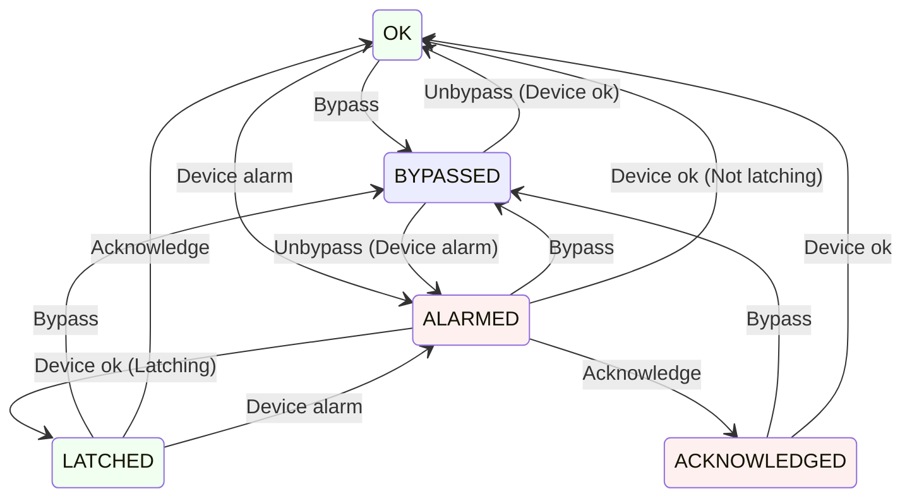

# acorn-alarms-service

A service that combines the alarms pathways for EPICS and ACNET, and provides a unified UI for viewing alarms.

## Operation

### Environment variables

The following environment variables may be set to configure the associated system properties.

- `CONTROLS_ALARMS_TOPIC` -> Configures the name of the topic in the Controls Kafka instance that alarms will be published to
- `CONTROLS_KAFKA_HOST` -> Configures the address of the Controls Kafka instance
- `DEV_DB_ADDR` -> Configures the address of the device database gRPC service
- `KAFKA_CONNECTION_SECONDS` -> Configures the amount of time, in seconds, to wait for a response from the Kafka server
- `PIP_II_ALARMS_TOPIC` -> Configures the name of the topic in the PIP-II Kafka instance that alarms will be published to
- `PIP_II_KAFKA_HOST` -> Configures the address of the PIP-II Kafka instance

## Design

### Startup

- Determine the set of all device alarms
  - Request all Devices having analog and/or digital alarms from an ACNET Device gRPC service
  - Request all Devices (i.e. PV's) having value alarms from an EPICS Device gRPC service
- If necessary, read the initial alarm state of every device alarm (TBD - we may get this for free by setting the listeners below)
- Read the most recent information from Kafka for all device alarms
  - Bypass state (EPICS only)
  - Snooze stop time (ACNET and EPICS)
  - Acknowledge state (ACNET and EPICS)
- Begin listening to all device alarms via DPM/Data-Cache for changes to alarm state
  - Devices should be divided into manageable subsets and listened to via multiple DRF requests (rather than one huge one)

### Alarm Listening

- Report changes of alarm states by adding records to a Kafka service
- Monitor Kafka for changes from clients (ACORN or Phoebus)
- Periodically re-request the set of all device alarms from Device gRPC service(s)
  - Cancel and re-issue alarm listening requests if device alarm set has changed

### Device/Kafka Alarm States

| ACORN          | Description
|----------------|------------
| `OK`           | There is not an alarm
| `ALARMED`      | There is an alarm
| `BYPASSED`     | There may be an alarm but we are ignoring it
| `ACKNOWLEDGED` | There is an alarm but user has acknowledged it
| `LATCHED`      | There was an alarm but no user acknowledged it

- Device is source of truth for alarm (ACNET and EPICS)
- Device is source of truth for bypass (ACNET)
- Kafka is source of truth for bypass (EPICS)
- Kafka is source of truth for acknowledge (ACNET and EPICS)
- Complete alarm state information can always be read from Kafka

### Server State Transitions



### Kafka Schema

A single Kafka topic shall be maintained for recording alarm state information. Keys shall be unique (non-duplicating records) and shall record the most recent state of an alarm for a given device.

Note that for ACNET devices, distinct records shall exist for analog and digital alarms, since both can be active at the same time.  EPICS devices can only have a single alarm active at a time, although they have a variety of potential alarm types.

The Key for a record shall be the device name and alarm type suffix, and the payload shall be a JSON string.

#### Alarm Type Suffixes for Keys

| Suffix | Alarm Type
|--------|-----------
| $A     | ACNET analog
| $D     | ACNET digital
| $E     | EPICS any

#### JSON Schema for Values
```
{
  "state" : "ok" | "alarmed" | "bypassed" | "latched" | "acknowledged"
  "time"  : <uint64 nanos since epoch 1/1/70>
  "user"  : <name of user who changed state>    //  optional
  "wake"  : <uint64 nanos since epoch 1/1/70>   //  optional
}
```

#### Example Kafka Records
```
G:AMANDA$A  { "state":"acknowledged", "time":1234567890, "user":"dave", "prev":"alarmed" }

PIP2IT:pHB650_CRYO_TX103:TempK$E  { "type":"epics", "state":"alarmed", "time":1234567890, "prev":"ok" }

Z:ACLTST$D  { "state":"bypassed", "time":1234567890, "user":"dave", "prev":"alarmed", "wake":1234599990 }
```

### User Actions

- Acknowledge Alarm
- Bypass/Unbypass Alarm
- Manage Alarm List(s)
