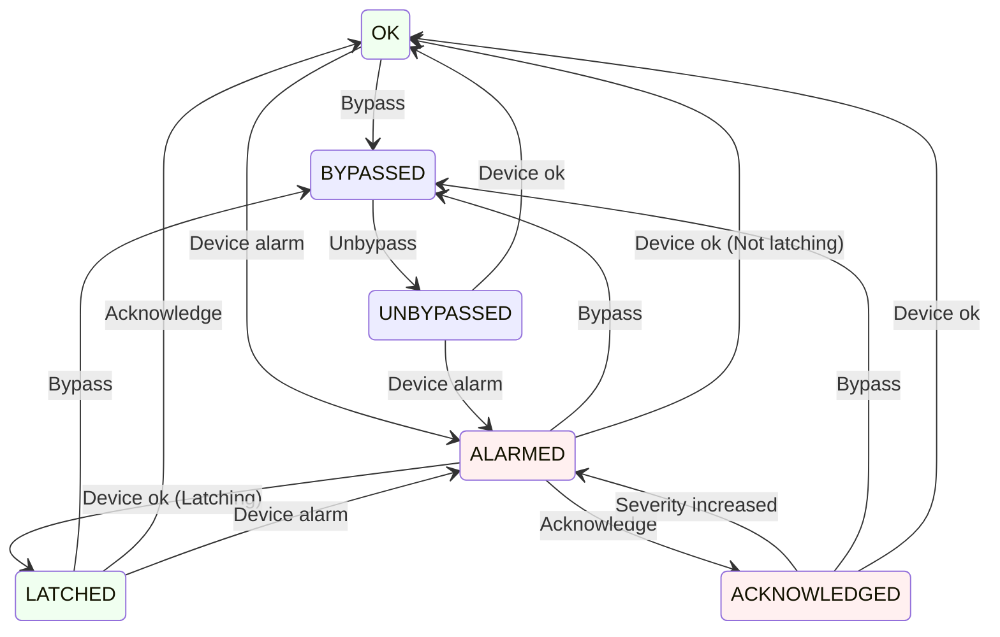

# acorn-alarms-service

A service that combines the alarms pathways for EPICS and ACNET, and provides a unified UI for viewing alarms.

## Operation

### Environment variables

The following environment variables may be set to configure the associated system properties:

- `CONTROLS_ALARMS_TOPIC` -> Configures the name of the topic in the Controls Kafka instance that alarms will be published to
- `CONTROLS_KAFKA_HOST` -> Configures the address of the Controls Kafka instance
- `DEV_DB_ADDR` -> Configures the address of the device database gRPC service
- `DPM_ADDR` -> Configures the address of the DPM gRPC service
- `EPICS_DEV_DB_ADDR` -> Configures the address of the EPICS device database gRPC service
- `KAFKA_CONNECTION_SECONDS` -> Configures the amount of time, in seconds, to wait for a response from the Kafka server

## Development

The following packages must be present on the host machine when building this application:

- `cmake`
- `libcurl4-openssl-dev`
- `libsasl2-dev`
- `zlib`

## Design

### Alarm States

| State          | Description
|----------------|------------
| `OK`           | There is not an alarm
| `ALARMED`      | There is an alarm
| `BYPASSED`     | There may be an alarm but we are ignoring it
| `UNBYPASSED`   | We are waiting for device state after bypass removed
| `ACKNOWLEDGED` | There is an alarm but user has acknowledged it
| `LATCHED`      | There was an alarm but no user acknowledged it

- Device is source of truth for alarm (ACNET and EPICS)
- Device is source of truth for bypass (ACNET)
- Kafka is source of truth for bypass (EPICS)
- Kafka is source of truth for acknowledge (ACNET and EPICS)
- Complete alarm state information can always be read from Kafka
- EPICS will update device state during bypass (must cache)
- ACNET will update device state after bypass is cleared

### Server State Transitions

### Setting Bypass / Clearing Bypass

Bypass and unbypass (activate) operations are **source-specific**: each operation targets a single `DEVICE#Source` pair (e.g. `"M:BEAM#Analog"`).  Bypassing one source for a device does not suppress alarms from other sources for the same device.

ACNET devices must be told to enter bypass via a DRF request, and must be told to clear bypass via a DRF request.  EPICS do not know about bypass, so they should ignore the requests if they get them.

### Device State Cache

A device state cache shall be maintained within the service to track the device state during bypass, so that an EPICS device may be returned to the correct state after bypass is cleared (alternatively we may query the device).  EPICS devices will update us during bypass, but ACNET devices will update us after bypass is cleared.

### Alarm Status Cache

An alarm status cache shall be maintained within the service to track the current alarm states and provide context for state changes.  The status cache shall contain the same information as Kafka, where Kafka shall provide the persistence and source of truth for alarm status.

#### Key

The Key for a message shall be the `Device` name, plus a suffix consisting of a '#' separator character and one of the possible `Source` values:

- "Analog"
- "Digital"
- "Epics"

For example(s):

- `G:AMANDA#Analog`
- `Z:ACLTST#Digital`
- `PIP2IT:pHB650_CRYO_TX103:TempK#Epics`

This will ensure that an ACNET device can have distinct analog and digital alarms, while an EPICS device has a single alarm of a type that can vary.

#### Value

The Value shall hold the following string fields:

| Name     | Contents
|----------|------------
| Device   | \<name of device without `Source` suffix>
| Source   | "Analog" or "Digital" or "Epics"
| Time     | \<seconds since epoch of change from user>
| State    | "Ok" or "Alarmed" or "Bypassed" or "Latched" or "Acknowledged"
| Severity | "None" or "Minor" or "Major"
| Detail   | \<meaning depends on `Source` and `Severity` fields - see [Detail Field](#detail-field) below>
| Ackable  | "True" or "False"
| User     | \<name of user who changed state>
| Wake     | \<seconds since epoch to wake from snooze>

#### Detail Field

The `Detail` field's data shall have different meanings depending on the `Source` and `State` fields:

| Source  | State                   | Detail              | Meaning
|---------|-------------------------|---------------------|--------
| Analog  | Alarmed or Acknowledged | Low or High         | The value is too low or too high
| Digital | Alarmed or Acknowledged | \<raw data value>   | The raw value containing digital alarm bits
| Epics   | Alarmed or Acknowledged | \<raw epics source> | The epics source value indicating the alarm type

### Alarm Configuration Info (Device DB)

There is information describing an alarm that is useful to users, but does not change frequently and is not part of a state transition message, but can be read from the respective Device DB's.  These data include:
  - Alarm Description
  - Guidance Message
  - Severity (ACNET)
  - Latchable (Acknowledgeable)

This information can change, but likely only infrequently.  A feasible update strategy for this information might be to query the Device DB for config data about an alarm whever a state change for that alarm is processed, with some throttle to prevent updates being too frequent (perhaps minimum 10 seconds between updates per device).

Another strategy would be to only request DeviceDB info when an app requests alarm info for particular devices.  This would naturally limit database requests to a "human timescale", barring any highly parallel or automated clients (which we should protect against by also having a throttle per above).

### Public Interface (GraphQL)

#### User Actions

- Acknowledge Alarm
- Bypass/Unbypass Alarm
- Manage Alarm List(s)
